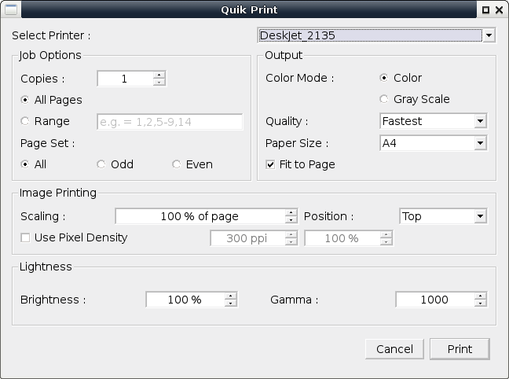

# Quik Print
Simple Qt frontend of lp command for using with HP Deskjet 2130 series

### Dependencies
* python-qt4  
* cups  

### Install
Open terminal and change directory to quikprint-master. Then run...  
`pip install --user .`  

### Uninstall
`pip uninstall quikprint`  

### Print a File
To print a file right click the file in file manager and select _Open With..._ Quik Print  

Or in a terminal type...  
`quikprint file.pdf`  

### Screenshot
