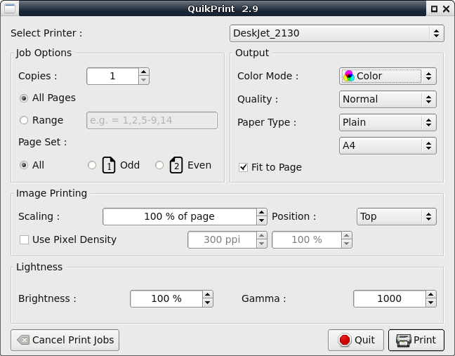

# QuikPrint
Simple Qt frontend of lp command for using with Epson Ecotank, HP Deskjet and Brother inkjet printers  

### Dependencies
* python3-pyqt5  
* cups  

### Install
Open terminal and change directory to quikprint-master. Then run...  
`pip3 install --user .`  

### Uninstall
`pip3 uninstall quikprint`  

### Print a File
To print a file right click the file in file manager and select _Open With..._ Quik Print  

Or in a terminal type...  
`quikprint file.pdf`  

### Screenshot

